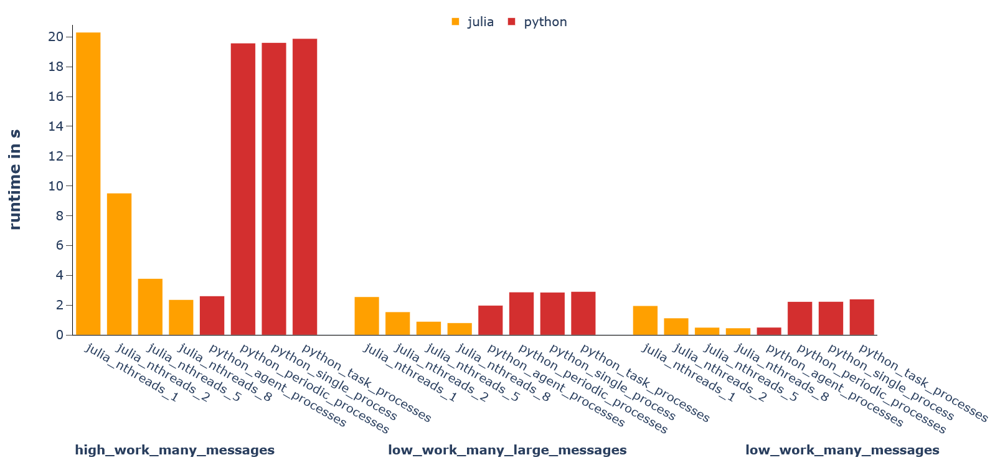

# Mango Benchmark
This repo contains benchmarks to compare the two implementations of the mango multi-agent framework:
* [mango](https://github.com/OFFIS-DAI/mango) in Python
* [Mango.jl](https://github.com/OFFIS-DAI/Mango.jl) in Julia

The aim of these scenarios is to measure the performance of mangos core features.
This mainly means it measures how efficiently tasks are allocated and messages are sent and handled.
All "workloads" in the agents is entirely simulated by static delays.
Thus, an implicit assumption here is that workloads in Python and Julia are equally performant.



## Benchmark Scenarios
Both frameworks are benchmarked on the same scenarios in which agents exchange messages periodically while simulating local workloads.
The parameters of a simulation run are:

Simulation Parameters:
* `simulation_name`
* `number_of_agents` - amount of agents that are created
* `number_of_containers` - amount of containers the agents are distributed on
* `rng_seed`
* `small_world_k` - neighbourhood range of the small world topology of agents
* `small_world_p` - probabilitly of extra connections of the small world topology

Agent Parameters:
* `work_on_message_in_seconds` - workload scheduled on each arriving message
* `work_periodic_in_seconds` - workload of periodic trasks
* `n_periodic_tasks` - number of periodic tasks
* `delay_periodic_in_seconds` - delay of periodic task executions
* `message_amount` - number of messages sent per agent
* `message_size_bytes` - message size
* `message_nesting_depths` - depth of the message dictionary

Agents get started and exchange messages until each has sent out `message_amount`messages and handled all incoming messages triggered by this process.
All communication is done directly via TCP.


Within this repository, three scenarios are parameterized:
* `low_work_many_messages` - small workloads and very frequent small (100 bytes) messages
* `low_work_many_larg_messages` - small workloads with frequent large (100kB) messages
* `high_work_many_messages` - high workloads with frequent medium sized (10kB) messages


## Installation
### Python
All Python requirements can be installed (ideally in a fresh virtual environment) via pip:
```
pip install -r requirements.txt
```

### Julia
The necessary Julia packages can be installed from the REPL using the `Project.toml` information:
```
julia --project=.
               _
   _       _ _(_)_     |  Documentation: https://docs.julialang.org
  (_)     | (_) (_)    |
   _ _   _| |_  __ _   |  Type "?" for help, "]?" for Pkg help.
  | | | | | | |/ _` |  |
  | | |_| | | | (_| |  |  Version 1.10.4 (2024-06-04)
 _/ |\__'_|_|_|\__'_|  |  Official https://julialang.org/ release
|__/                   |

(mango_benchmark) pkg> instantiate
```

## Running Benchmarks
Python benchmarks are run by calling:
```
python python_files/run_sim.py
```

Julia benchmarks are run by calling:
```
julia --project=. julia_files/run_sim.jl <run_name>
```

Alternatively, julia runs for 1,2,5, and 8 threads can be executed via:
```
./julia_files/start_all.sh
```

## Plotting Results
Results can be plotted via:
```
python evaluation/eval_all.py <dir_name>
```

This parses all results files in `<dir_name>` and creates a plotly plot grouped by scenario and language.